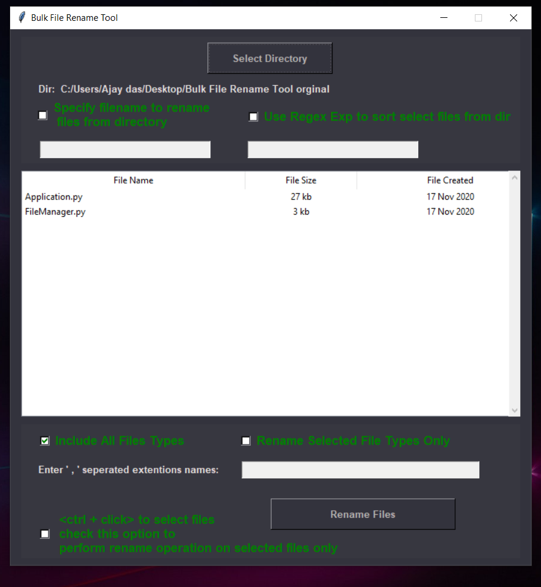
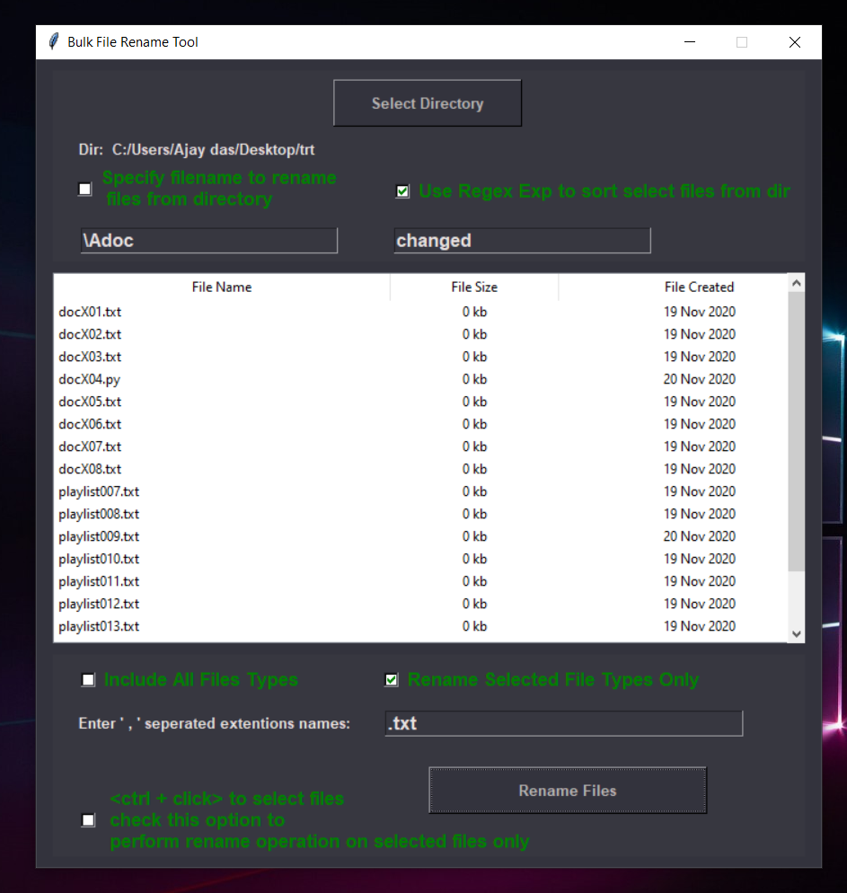
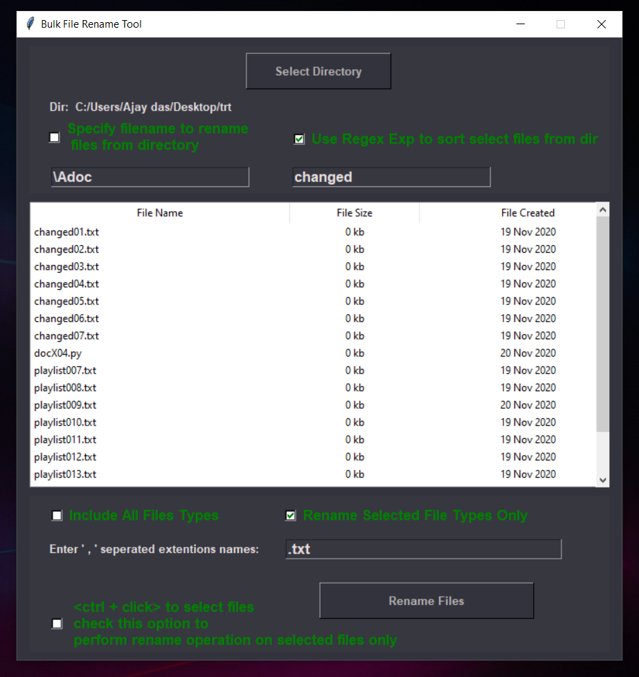

# Bulk File Rename Tool
Bulk File Rename tool is an application gui developed to allow users to rename huge files in a certain directory using certain namming convention stated solely by the user itself.



# Key Features!

  - Rename all or selected files in a certaion directory with proper file numbering.
  - Can use regex to rename only matching files.
  - User can also specify the types of files to rename like { .exe, .png, .jpeg } etc.
  - Users also have the option to select certain files from the UI filelist to rename


You can also:
  - Sort files based on filename, filesize and date of creation.
  - The changes can be seen directy in the application UI without having to manually check  the directory.
 
Bulk File Rename Tool is really a lightweight application that can save users a lots of time and reduce the error rate significantly, because selecting individual file one by one and renaming can be quite prone to an individual making errors.

> The overriding design goal for Bulk File Rename tool
> was to automate the time consuming rename files 
> task yet reduce the risk of individual error 
> as far as possible.Once getting used to the
> application UI interface it can be really
> easy task in hand.

### Python packages used

* Tkinter 
* Os
* Sys
* Regex (re)
* Date Time

### Launching the application

Bulk File Rename Tool requires [Python](https://www.python.org/downloads/) v3+ to run.

```sh
> python application.py
```

# Important Notes
 
   * The Regex expresion passed in as input will only be matched with the filename.
   * Keeping that in mind the selected file type option is provide to handle the case where user might want to select filename of certain pattern but also want to include only selected extention.
   * Eg: For filename docfile1.png the regex passed in as input by the user will be matched to the docfile1 not to the full file name including the extention.
   * For selecting files with having 'doc' charaters at start of the filename  and having  extention '.txt' would be:



* Resulting  Output:



* To select only certain number of files select rename selected files option and use mouse to click on the files holding ctrl to choose files from the scrollable filelist.


### Todos

 - Option to select or merge files from multiple file directories.
 - Option to revert from the changes
 - Option to rename files to a different directory or maybe a copy of files.

License
----

GNU


